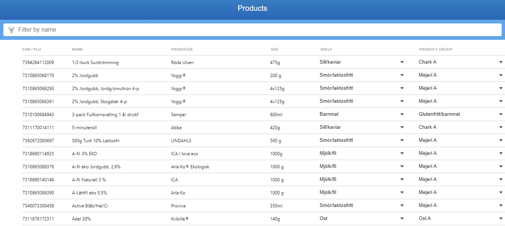
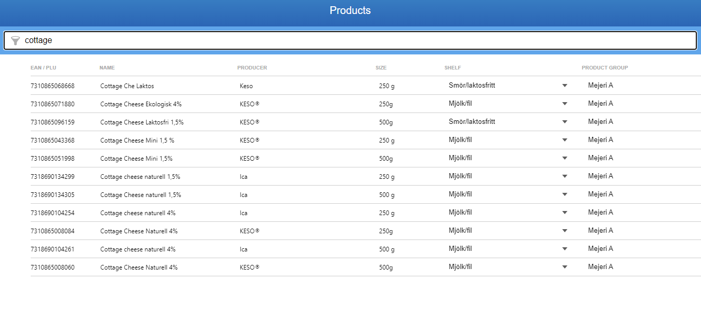
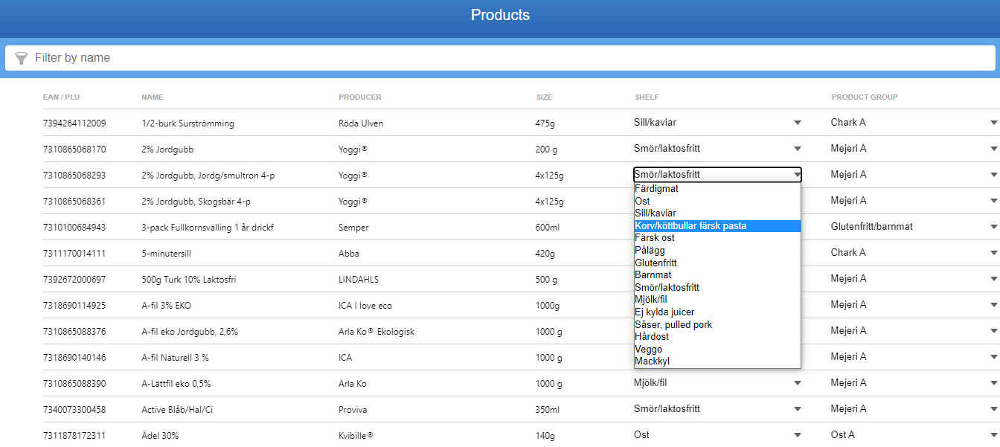

# React Product List 

A React App to display list of products using React-Window. It also uses redux for state management.

## Steps to run the APP

- Clone repository
`git clone https://github.com/shathee/react-product-list.git`
- Install its dependencies
`npm install`
- to run in Development server
`npm start`
- to build for Production
`npm run build`

## Live Demo

you can check the live demo [https://mighty-caverns-15257.herokuapp.com/](https://mighty-caverns-15257.herokuapp.com/) or here [http://152.70.169.51/react-product-list/](http://152.70.169.51/react-product-list/)

## Screens

<h3>All Products</h3>

<h3>Filtered Products</h3>

<h3>Selectable  Dropdown</h3>

